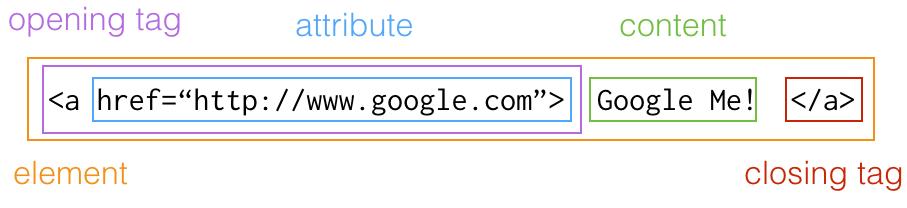

##Frontend Course Session 2

| [S1 ](../session_1/README.md) | [S2  ](../session_2/README.md) |[S3  ](../session_3/README.md) |[S4  ](../session_4/README.md) |[S5  ](../session_5/README.md) |[S6  ](../session_6/README.md) |[S7  ](../session_7/README.md) |[S8  ](../session_6/README.md)|
|-------------------------------|--------------------------------|-------------------------------|-------------------------------|-------------------------------|-------------------------------|-------------------------------|------------------------------|
**Please read through both this document and the session pdf**

Session outline
- [Recap from session 1][1]
- [Introduction to the IDE][2]
- [Anatomy of an HTML element][3]
- [Different Types of Elements][4]
- [Further Reading][5]
- [Exercises][6]


Recap
-----
In the previous session we talked about the history of the web and how HTML and CSS were created. We discussed the usage of HTML as being the structure of a document and CSS as being responsible for style.

For the final part of the session, we worked on 3 exercises from thimble.mozilla.com to hit the ground running and start coding.


Introduction to the IDE
-----------------------
IDE stands for Integrated Development Environment. For this course we will be using the one provided by [Koding][7].

An IDE has 3 main parts:
- Terminal
- Text Editor
- File System


For this course, we will be using the file system and the text editor extensively. The file system is similar to any you have already encountered, giving you a graphical view of all your files and folders.

On the other end, we have the text editor. The editor allows you to write your code in plain text rather that rich text format (RTF) like some other tools do (MS Word, Pages, etc...). There are many different types of text editors available, such as Atom, Sublime Text, notepad++, and vim. For simplicity, the editor within Koding will suffice for the purpose of this course.

The main thing that we need from a text editor at this stage is to allow syntax highlighting. An example of this would be when the text editor knows that you are working on an HTML file (from the `.html` extension at the end of the filename) and then colours the code accordingly.

```asciidoc
<!-- Code Block 1 -->

<html>
  <body>
    <h1>Hello, world!</h1>
  </body>
</html>
```

Versus

```
<!-- Code Block 2 -->

<html>
  <body>
    <h1>Hello, world!</h1>
  </body>
</html>
```

From the above examples, we can see that code block 1 does not have the 'highlighting' present in code block 2.


Anatomy of an HTML element
----------------------

Looking at HTML for the first time might be daunting to many. Let's try to make this easier by breaking down an `<a>` tag into its components.




The above example shows an `a` (anchor) element being used. This is a great chance to point out the difference between a 'tag' and an 'element' as this will solve any confusion in the future.

A tag is just the opening or closing entity, in the above example, it is the `<a>` and the `</a>`. These are referred to as closing and opening tags accordingly. The opening tag also contains the attributes, if there are any. In this example, we have on attribute, which is pointing to the Google URL. You can think of attributes as being properties that change and adapt the behaviour of an element.

An element on the other hand, is the collection of tags, attributes, and content. It is what holds them together. So if you hear talk about elements and tags, now you know the difference.

**Further Points: **
- Some elements don't have closing tags, such as `<br>` and  ``. For
- Some elements do not require content to live in between the closing and opening tag. *We will take a look at some of them when we learn CSS*.


Different Types of Elements
---------------------------
There are many different HTML elements, and each one has its own usage. Some may overlap in functionality and others may be considered no useful depending on the job at hand.

For a full and extensive list of these elements, please see [MDN][8].

In this Session, we will be working primarily with the following elements:
- Headings
- Paragraphs
- Line Breaks
- Lists
- Images
- Anchors

Of course, we have seen different elements in the HTML documents outside `<body>`, such as `<html>`, `<head>`, `<title>`, `<meta>` etc...

```
<!doctype html>

<html>

  <head>
    <title>My Grocery List</title>
    <meta charset="UTF-8">
  </head>
  
  <body>
    <h1>Grocery List</h1>
    ...
    ...
    ...
  </body>
  
</html>
```

###Headings

There are 6 different elements that belong to the heading family.
```
<h1>Heading 1</h1>
<h2>Heading 2</h2>
<h3>Heading 3</h3>
<h4>Heading 4</h4>
<h5>Heading 5</h5>
<h6>Heading 6</h6>
```
They range in size, the largest being `<h1>`. They are also meant to give more meaning to the content of the page. Think of an essay that you have written, it will have a title and many sections, each with their own subsection. Headings reflect this significance of a section by giving it a more visual meaning.

Consider the following two examples, the first one is using the heading elements according to content of the page while the second one is not. Think about how relevant this would be to any website.


**VERSUS THE FOLLOWING:**


###Paragraphs
Paragraphs are the heart and soul of your content. They are the elements that hold most of the text in a web page

An example paragraph:

```vbscript-html
<p> I am learning HTML and CSS. HTML delivers structure while CSS delivers the Style! </p>
```

OR for longer pieces of writing, we can make the opening and closing tags sit on seperate lines for clarity when editing the code

```html
<p>
  Lorem ipsum dolor sit amet, consectetur adipisicing elit.     Veritatis accusantium accusamus ratione deleniti eius doloremque debitis eligendi assumenda praesentium tenetur maiores delectus odio commodi natus, reiciendis quidem tempore at placeat?
  Lorem ipsum dolor sit amet, consectetur adipisicing elit.     Incidunt qui, accusamus fuga corporis reprehenderit voluptates perferendis animi necessitatibus quas consequuntur dolor quod accusantium, quibusdam sequi nisi commodi impedit, libero doloribus!
</p>
```

###Line Breaks
Line breaks are used in the same way that you use ENTER. Keep in mind that using `<br>` is not a 'good' way of writing HTML, because using it means you are adding some style factor. This should be left for CSS.

###Lists
There are three types of lists:
- Ordered Lists
- Unordered Lists
- Definition Lists

The most common type is the unordered list. The items under this list are not given any particular significance over other items within the same list. The look like bullet points if unstyled.

```
<ul>
  <li>Item</li>
  <li>Item</li>
  <li>Item</li>
</ul>
```

Ordered lists add the dimension of chronological ordering.

```

<ol>
  <li>Item</li>
  <li>Item</li>
  <li>Item</li>
</ol>
```

See the difference here:


*NOTE*: Definition lists will not be used in this course, but feel free to look them up.

###Images
The `` element is used to add imaged to the document. The most commonly supported image formats are `.png`, `.jpg`, and `.gif`.

The `img` element does not require a closing tag. Here are two examples of this element being used. The first one will call on an image that we have stored locally and the second one will call on a remote image (not stored locally).

```


```

So let's understand what is happening here. We have one tag, an opening tag and inside it we have two attributes. The first one is a mandatory attribute and it points to the image URL. The second one is a description of the image, users will see this displayed if the image URL is wrong, the image is not in one of the supported formats, or if the image is not yet downloaded.

###Anchors
We have seen anchors previously in the example that explained the anatomy of an HTML element. An anchor defines a hyperlink to a location on the same page or any other page on the Web. It's most famous attribute is the `href`, which indicates the link target through a URL.


Further Reading
---------------
- [MDN Documentation on HTML][9]
- [Full list of all elements][10]
- [Full list of all attributes][11]
- [Tag vs Element][12]
- [Elements, Tags & Attributes][13]


Exercises
---------

###Exercise 1
- Go to your `my-grocery-list.html` on koding.com
- Display a picture of all the grocery items
- Add a link to each list item that links to a related Google image.
- Make these links open in a new tab

###Exercise 2
- On koding.com create a new folder under Web and name it frontend-course
- Inside `frontend-course` folder create a folder called `session-2` 
- Create a file and name it `exercise2.html`
- Replicate the following screenshot using all the different elements that we have learned about so far


  [1]: https://github.com/warwickcoding/frontend/tree/master/session_2#recap
  [2]: https://github.com/warwickcoding/frontend/tree/master/session_2#introduction-to-the-ide
  [3]: https://github.com/warwickcoding/frontend/tree/master/session_2#anatomy-of-an-html-element
  [4]: https://github.com/warwickcoding/frontend/tree/master/session_2#different-types-of-elements
  [5]: https://github.com/warwickcoding/frontend/tree/master/session_2#further-reading
  [6]: https://github.com/warwickcoding/frontend/tree/master/session_2#exercises
  [7]: http://www.koding.com
  [8]: https://developer.mozilla.org/en-US/docs/Web/HTML/Element
  [9]: https://developer.mozilla.org/en-US/docs/Web/HTML
  [10]: https://developer.mozilla.org/en-US/docs/Web/HTML/Element
  [11]: https://developer.mozilla.org/en-US/docs/Web/HTML/Attributes
  [12]: http://htmldog.com/guides/html/beginner/tags/
  [13]: http://csswizardry.com/2011/01/html-elements-tags-and-attributes
