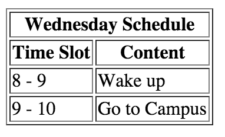

## Frontend Course Session 3

| [S1 ](../session_1/README.md) | [S2  ](../session_2/README.md) |[S3  ](../session_3/README.md) |[S4  ](../session_4/README.md) |[S5  ](../session_5/README.md) |[S6  ](../session_6/README.md) |
|------------------------------|--------------------------------|-------------------------------|-------------------------------|-------------------------------|-------------------------------|

**Please read through both this document and the session pdf**

Session Outline:
- Recap from session 2
- Intro to tables
- Forms
- IFrames and Embeds
- Exercises

Exercises
---------

###Exercise 1
[SOLUTION](http://codepen.io/zlahham/pen/KVYROy)
- Create a table that lays out your schedule for Wednesdays:
    - A “Time Slot” column
    - A  “Content” column
- Find out how to add a border to a table

It should look similar to the following screenshot. But expand it so that it shows your full schedule

###Exercise 2
[SOLUTION](http://codepen.io/zlahham/pen/PZgaYz)
Create a form that has the following:
- It asks you for you first name, last name, age
- Asks for your email, telephone number, address
- a Submit button that has a value of “Register!”
- Group these inputs accordingly

###Exercise 3
[SOLUTION](http://codepen.io/zlahham/pen/GoLGjj)
Create a form that has the following features:

- A label to distinguish it
- A search box to input text
- a Submit button that has a value of “Search now!”
- When clicked, it should send you to `http://www.google.com/search`
- For example, when I type in "Cats", it should send me to a Google page that already has the search content for Cats

*Hint*: Look up the `action` and `method` attributes for the `<form>` element.

###Exercise 4

Create a Pizza ordering webpage. It should have everything from the sign up to the pizza choices, including topping choices.

- Create a Sign up form for it first
- Each pizza must come with optional toppings
- The mandatory toppings should be preselected

*Hint*: Look at another website and take inspiration. Dominos or Pizza Hut

###Exercise 5

Continue working on your “Blog” from last time and add some of the new elements you used today to that blog.

Examples:
- Something from Soundcloud that you like
- Map of some place you are fond of

