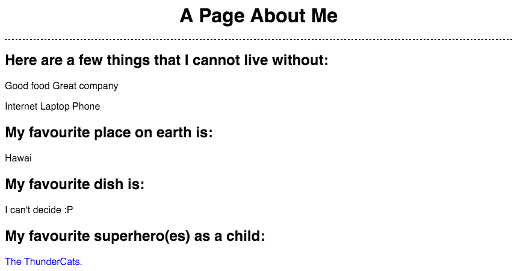

## warwickCoding Frontend Session 3

| [S1 ](../session_1/README.md) | [S2  ](../session_2/README.md) |[S3  ](../session_3/README.md) |[S4  ](../session_4/README.md) |[S5  ](../session_5/README.md) |[S6  ](../session_6/README.md) |[S7  ](../session_7/README.md) |[S8  ](../session_6/README.md)|
|-------------------------------|--------------------------------|-------------------------------|-------------------------------|-------------------------------|-------------------------------|-------------------------------|------------------------------|

**Please read through both this document and the session's pdf**

Session Outline:
- Recap from Session 3
- Intro to CSS
- 3 Ways to embed CSS
- CSS selectors
- `id` vs `class`
- CSS style conventions
- Property value pairs
- Exercises

Exercises
---------
Please read the following instructions carefully. Remember, you have to be on Koding.com.
Another reminder is to create all your files under the "Web" directory.

###Exercise 1
[SOLUTION](http://codepen.io/zlahham/pen/yerEgE)

For this exercise, you will have to do the following:
- In your Koding editor, create a new folder and call it `session-4`
- Inside that folder, create an `exercise-1` folder
- Find the folder for `session-4` in this repository
- Copy the contents of `index.html` and `styles.css` into two new files with the same names in your newly created `exercise-1` folder in Koding
- Change the content inside the `index.html` to make it about you!
- Replicate the styles that are shown in the screenshot below.

You are expected to add a minimum of **6** new rules to the `styles.css` file and 1 line to the `index.html` in order to finish this exercise.

###Exercise 2
[SOLUTION](http://codepen.io/zlahham/pen/bEJKWo)

For this exercise, you will have to do the following:

- Same initial setup as before, create a new folder that is called `exercise-2`
- Under this repo, find the folder for `exercise_2` and copy the code inside `index.html` and paste it in Koding inside a file that you will create with the same name.
- Insert the warwickCoding logo that is in the folder. Make sure that it is sized properly.
- Get rid of all ` ` tags and find something more suitable through CSS, *HINT*: Display
- Move the CSS into a separate file.
- Add another row to the table that include the Ruby course
- Colour the borders of that table
- Seperate the page into different sections, for example: About, Schedule, Registration, Contact

###Exercise 3

- Go to your "blog" from the first session
- Add a background color to the whole page
- Try to find how to use the "Roboto" typography. *HINT*: Google Fonts
- Make every text on this page show in Roboto

