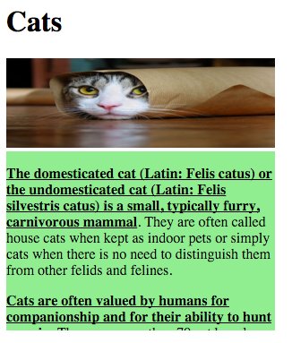
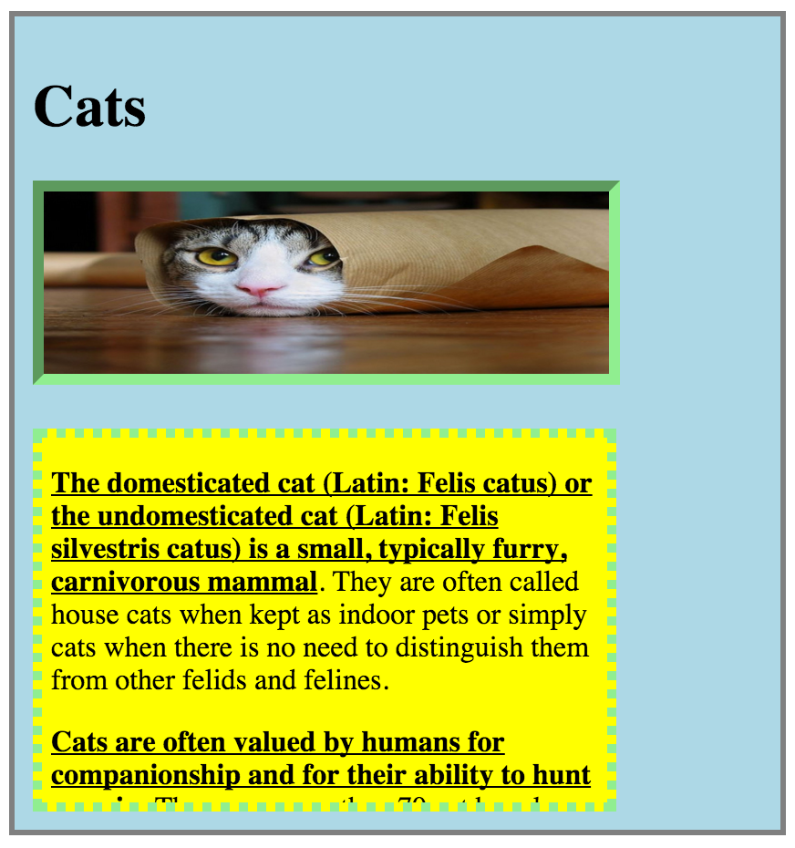
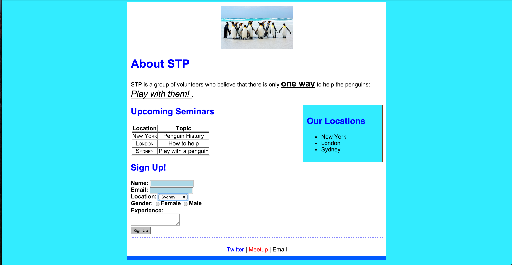

## Frontend Session 5

**Please read through both this document and the session's pdf**

Session Outline:
- Recap from Session 4
- Block vs Inline
- Box Model, *Read more [here](https://developer.mozilla.org/en/docs/Web/CSS/border-style)*
- Positioning
- Floats and clears
- Exercises

Exercises
---------

Please read the following instructions carefully. Remember, you have to be on Koding.com.
Another reminder is to create all your files under the "Web" directory.

### Exercise 1
- Find the `index.html` file inside the `exercise-1` folder.
- Create a `
` for the paragraphs and style it according to the following screenshot
- Create a `` for the first sentence of each paragraph and style it appropriately
- Resize the image to match the width of the div

### Exercise 2
Please read more on the CSS box model [here](https://developer.mozilla.org/en-US/docs/Web/CSS/CSS_Box_Model/Introduction_to_the_CSS_box_model)

- Look at the followinf screenshot, your page should look similar
- Use the resulting HTML and CSS pages from Exercise 1
- Add appropriate margin, border, and padding to the text `
`.
- Add appropriate border to the image.
- Create a `
` for all of the page content and center that in the middle of the page.
- Add appropriate border and padding to that div.

### Exercise 3
- Use the `index.html`and `styles.css` that are inside the `exercise-3` folder to generate the following screenshot
- Add a `
` for all of the content. Add styles to that `
` so it is centered on the page and has appropriate border and padding.
- Add a `
` for the header (the penguin picture). Add styles to that div so the image is centered.
- Add a `
` for the footer links. Add styles to that div so that the links are centered and it has appropriate border, padding, and margin.
- Add a `
` for the locations list. Add styles to that div so that it floats to the right and has appropriate border, padding, and color.

