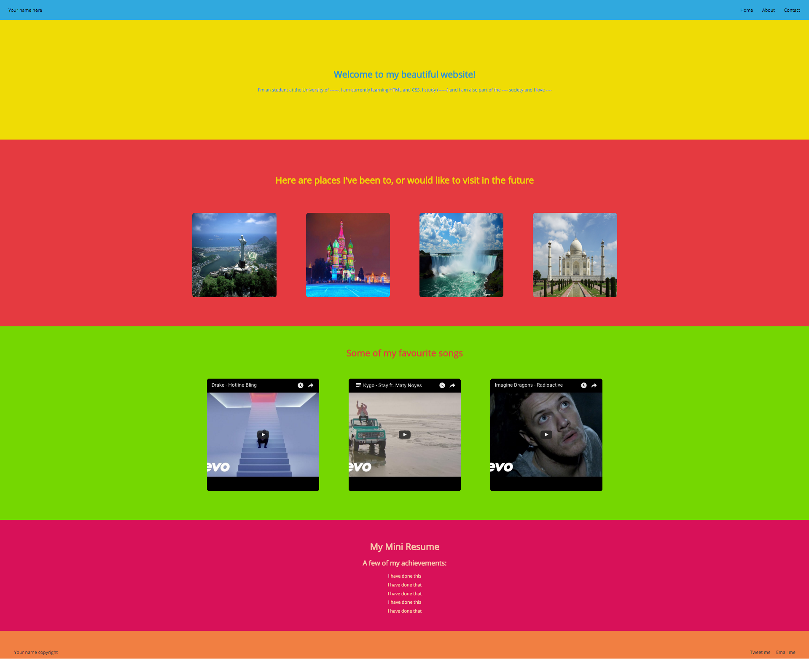
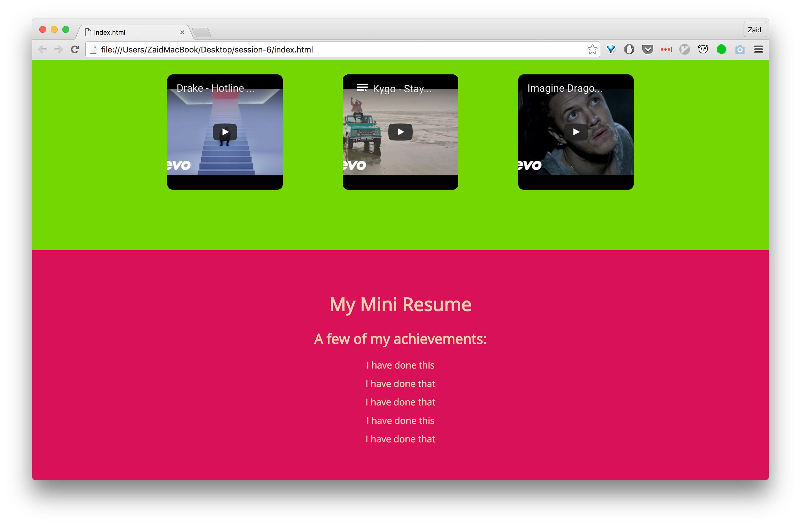

## Frontend Session 6

**Session Navigation:**

| [S1 ](../session_1/README.md) | [S2  ](../session_2/README.md) |[S3  ](../session_3/README.md) |[S4  ](../session_4/README.md) |[S5  ](../session_5/README.md) |[S6  ](../session_6/README.md) |
|------------------------------|--------------------------------|-------------------------------|-------------------------------|-------------------------------|-------------------------------|

Session outline:
- Installing Atom
- Tour around Atom
- Quick Recap
- Tutorial
- Exercises

In this session we will be following a tutorial to solidify our existing knowledge of HTML and CSS. After you are done with the tutorial, please attempt to tackle the exercises that follow.

For the tutorial, I encourage you to work in pairs and discuss the steps with the person next to you. Make use of all the previous sessions' resources and try to get into the habit of going to Google/MDN/w3Schools to find answers. If you are stuck let us know.

I hope you enjoy this!

Atom
----
Please visit https://www.atom.io and download this text editor. While you are waiting for the download, go through the website and read more about this editor.

The reasoning behind switching to this editor at this point in the course is based on Koding becoming too slow for now and Atom will be a program that runs on your computers, this is much faster and it's used by developers all of the world. It's community has been growing despite its young age!

I'll go through a quick tour after you've downloaded it.

List of useful packages:
- atom-beautify
- autoclose-html
- file-icons
- emmet
- pigments
- color-picker

List of nice syntax themes:
- batman-syntax
- seti

If you would like to explore packages, go to Install when you open the Preferences and look around until you find something to your liking.

APM is Atom's built in package manager, it allows you to install packages very easily.
https://atom.io/packages
https://atom.io/themes

Tutorial
--------
In this tutorial we will be build a page that will look similar to the this:



This tutorial will be broken down into the following parts:
1. Deciding what our page will initially look like
2. Setting up our HTML page
3. Styling each section individually
4. Wrapping up and making the final modifications

### 1. Deciding on the content.
We want our page to have a navigation bar, a hero section, a places visited section, favourite songs, a mini resume, and finally a footer.

Now we know what kind of content our page will contain and we will then begin to write up the HTML code to set it up.

### 2. Setting up the HTML
When we want to create any page, we should always start with the HTML layout. We should make it as clean as possible in order to make our life easier when moving on to the CSS.

Logically, the first place to start would be our navigation bar, as it is the topmost part of our page. However, in this instance we are going to do something different, we will write a few lines of CSS.

But before all of this, we are going to set up the bare minimum for an HTML page to exist.

- Create a new folder and call it `session-6`, for now create this on your Desktop and then open up Atom and under "File", select "Add Project Folder". Look for your newly created folder under Desktop and open it. You should see something that is similar to this:


- When you get here, right click on session-6 and create two files, name the first one `index.html` and the second `styles.css`.

- So now we have our files ready, open the index page


- In our empty HTML page, lets write up the following code:

```html
<!DOCTYPE html>
<html>
  <head>
    <meta charset="utf-8">
    <title>Your name here</title>
  </head>
  <body>
    
  </body>
</html>
```

- **TIP**: you can type `html` and then press TAB, this will automatically fill in the above code snippet for you!

- Next step is to link this page to our CSS. To do so fill in the following line into the `<head>`.

```html
<link rel="stylesheet" href="styles.css">
```

- Or you can type `link` and press TAB, it's upto you :)

- Open the CSS file and lets type the following:

```css
body {
  padding: 0;
  margin: 0;
}
```

- This basically resets the original paddings and margins that ship with HTML. We'll see how this is going to be useful later. Read more about CSS resets [here](http://cssreset.com/what-is-a-css-reset/)

- Let's go back to our HTML and start filling in some of the parts

- We'll begin with creating a `div` that will contain all of the page. `div` and then Tab and then fill in `class` with: `main`.

- Adding the above div will make it easier for us to manipulate the CSS at a top level. We'll now move on to creating the following `div`s inside that one.

```html
<div class="nav-bar">
</div>

<div class="hero">
</div>

<div class="places">
</div>

<div class="songs">
</div>

<div class="resume">
</div>

<div class="footer">
</div>
```

- Think about why we added these divs and discuss this with the person next to you.

- We will now focus on the `nav-bar` and move on to the other ones when were done. Add the following lines inside the `nav-bar` div.

```html
<p>Your name goes here</p>
<ul>
  <li>Home</li>
  <li>About</li>
  <li>Contact</li>
</ul>
```

- We are simply adding the content that will be displayed on the nav-bar. By now your page should look like this:


- On to the `hero` now. Our hero will have welcome visitors and then have a sentence about you. You know the drill, fill in the missing parts and add/remove/modify to your liking. Add a picture of yourself to the img element in this section.

```html
    <h1>Welcome to my beautiful website!</h1>
    <p>I'm an student at the University of ------, I am currently learning HTML and CSS. I study (------) and I am also part of the ---- society and I love ----</p>
    
```

- We're now up to the `places` div and this is where we start to add more stuff. We want to ad a sentence about what the pictures resemble and then add 4 picture of places you have been to before, or would like to visit.

```html
<h1>Here are places I've been to, or would like to visit in the future</h1>
```

- After adding this heading, we will then proceed to layout how this div should be displayed. We want all of our images to have some shared CSS properties, so lets put each image into a div with the same class name.

```html
<div class="places-image">
  
</div>

<div class="places-image">
  
</div>

<div class="places-image">
  
</div>

<div class="places-image">
  
</div>
```

- By now, we should be getting a better idea about how we will manipulate the images. I'll leave it up to you to choose your images. If you want to use a local file on your computer, remember to have it in the same folder as this project and inside the `src` add the name of that file.

- So, before moving onto the next section, let's try to see how our page looks like so far. Open the folder that these files are in and right click on `index.html` and open it in Chrome/Safari. Make sure to save before you do this.


- Obviously the images will come in different sizes, so let's just ignore that for now. But overall, our page is almost there in terms of HTML.

- Next. Your favourite songs! Go to Youtube and pick 3 songs, grab each of their embed codes and put all this under the `songs` div.

- Also, you could add a heading to this section as well.

- We'll now add the content of the next section, the resume part. Please fill in the following as you would like it to appear.

```html
 <h1>My Mini Resume</h1>
<h2>A few of my achievements:</h2>
<ul>
  <li>I have done this</li>
  <li>I have done that</li>
  <li>I have done that</li>
  <li>I have done this</li>
  <li>I have done that</li>
</ul>
```

- Final section, our footer. We want this to have an "Email me" and a tweet me/somethingelse link. Oh, and we want to display your name/alias there as well.

```html
<p>Your name &copy;</p>
<p>Email me</p>
<p>Tweet me</p>
```

By now, we have finished setting up our HTML page, you'll find that the following screenshot will look similar to how your HTML is at this point. Let's move on to the CSS

]

### 3. CSS

The the way we will approach the CSS in here would be through working on each section and then when we are done, we'll move on to the next.

- Before we start with the nav-bar, let's add our favourite font-family to our `body`. To do so, we can go to [Google Fonts](https://www.google.com/fonts) and find a family that we would like to use. Let's say we wanted to go with "Droid Serif", scrolling down to the bottom of its page, we can see a "Add this to your website" area.


- Copy the code that begins with `<link............` into the head section of your HTML.

- Now we have a font family, so let's add the following to our CSS:

```css
body {
  padding: 0;
  margin: 0;
  font-family: "Put the name of the font you just grabbed in here";
}
```

- Moving on to the nav-bar, we want it to have a certain height and a bg color

```css
.nav-bar {
  height: 70px;
  background-color: #30A9DE;
}
```


- Next logical thing to do would be to style the `ul` and `li`.

```css
.nav-bar ul {
  float: right;
  margin: 25px 0;
}

.nav-bar li {
  list-style: none;
  display: inline;
  padding-right: 30px;
}
```

- Now we want to style our name on the right hand side of the nav bar. So we'll be selecting the `p`:

```css
.nav-bar p {
  display: inline;
  float: left;
  padding-left: 30px;
  margin: 25px 0;
}
```


- Ah, much better. Now lets move to the `hero` div. We want this to have a bg color, centered text, and some margin and padding.

```css
.hero {
  padding: 150px 0;
  background-color: #EFDC05;
  text-align: center;
  color: #2b90d9;
}

.hero p {
  margin-bottom: 75px;
}
```


- Looking better. Now the `places`. This section should have a bg color, spacing between the images and each image should have the same dimentions.

```css
.places {
  text-align: center;
  background-color: #E53A40;
  padding: 70px;
  color: #EFDC05;
}

.places-image {
  display: inline;
}

.places-image img {
  width: 300px;
  height: 300px;
  margin: 50px;
  border-radius: 10px;
}

.places-image p {
  display: inline;
}
```

- A few of the rules inside `places` are purely for styling and it is up to you to include them.


- After that, we need to add our `songs` area. This will also have a bg color, centered text and some spacing.
- We also want to change the width and height of the 3 youtube embedded videos. To do so, please remove these attributes from the HTML individually, and then enter the followinf code into your stylesheet

```css
.songs {
  padding: 50px;
  text-align: center;
  background-color: #75D701;
  color: #E53A40;
}

.songs iframe {
  height: 200px;
  width: 200px;
  margin: 50px;
  border-radius: 10px;
}
```


- Into the `resume` part we go. Here were going to add some colors, spacing and so on:

```css
.resume {
  background-color: #D81159;
  padding: 50px;
  text-align: center;
  color: #f9cdad;
}

.resume li, ul {
  margin: 0;
  padding: 0;
}

.resume li {
  list-style: none;
  margin-bottom: 10px;
}
```

This get our page to look like this:



- Last, but not least, our footer. I'll leave this up to you, try to play around with the different possibilites. Take inspiration from other footers you come across.

Exercises
---------

### Exercise 1
Try to create a replica of this following screenshot:

- For the icons, look into FontAwesome
- For the images, you can grab it from WIRED's twitter profile
- For the colours and fonts inspect a similar tweet.


