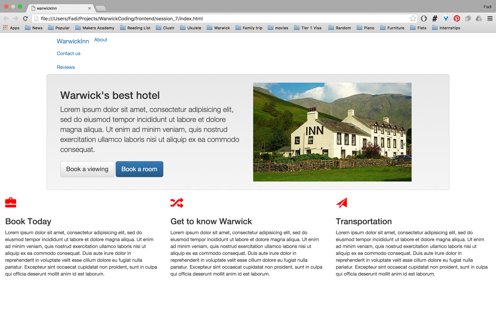

## Frontend Session 7

**Session Navigation:**

| [S1 ](../session_1/README.md) | [S2  ](../session_2/README.md) |[S3  ](../session_3/README.md) |[S4  ](../session_4/README.md) |[S5  ](../session_5/README.md) |[S6  ](../session_6/README.md) |[S7  ](../session_7/README.md) |
|------------------------------|--------------------------------|-------------------------------|-------------------------------|-------------------------------|-------------------------------|

Session outline:
- Bootstrap
- Tutorial
- Exercises


In session we will be following a tutorial to learn how to use a really popular HTML&CSS framework called Bootstrap.

For the tutorial, I encourage you to work in pairs and discuss the steps with the person next to you. Make use of all the previous sessions' resources and try to get into the habit of going to Google/MDN/w3Schools to find answers. If you are stuck let us know.

I hope you enjoy this!

Bootstrap
---------
In order to build a website we learned that we need 3 main components:
- HTML: Page Structure
- CSS: Element Styling
- JavaScript: Page Behavior (we are not covering JavaScript during this course)

We design the page structure using HTML (what we did in the first 3 sessions) using HTML elements in files such as index.html, then we style the elements using CSS properties in files such as styles.css and if we were to do JavaScript we would have used .js files to add behavior to the page. This process includes a lot of movement between the different files that make out a website. A framework will make this process a lot more easier.

**What is a Framework?**

A framework is a set of tools that help assist us building our website.

**Most Popular framework for styling and organising websites is Bootstrap**

Bootstrap allows us to focus on the HTML by skip writing the CSS. We do that by using existing CSS files to add styling to our page.

Tutorial
--------

During this tutorial we will a landing page for Warwick's finest Inn, the page should look similar to this:

- insert picture

This tutorial will be broken down into the following parts:
- Setting up the HTML
- Setting up Bootstrap (using CDN)
- Centering Content using ``` container ``` class
- Difference betwwen ``` container ``` and ``` container-fluid```
- Grid: columns and rows ```col-md-*```, ```row```
- Typography Classes: ```lead``` , ```text-*```
- Glyphicons: ```<i></i>```, ```glyphicon```
- Well and Buttons
- Nav Bar


**Remember! Don't copy and paste**


Setting up the HTML
-------------------
Just like we said before the first step to create any web page would be to first setup its structure using HTML.

- create a directory and name it ```session_7```
- create a file in the directory ```session_7``` and name it ```index.html```
- In the empty HTML file insert the following code:
```
<!DOCTYPE html>
<html>
  <head>
    <meta charset="utf-8">
    <title> warwickInn </title>
  </head>

  <body>
    <h1>WarwickInn</h1>
    <h2>Warwick's best hotel</h2><p></p>
    <button>Book a viewing</button>
    <button>Book a room</button>

    <h3>Book Today</h3><p></p>
    <h3>Get to know Warwick</h3><p></p>
    <h3>Transportation</h3><p></p>
  </body>
</html>
```
- The page should look like something like this:


- As you can see our page doesn't have any styling, in order to add some styling to our page we need to setup Bootstrap within our HTML. Continue to setup Bootstrap.


Setting up Bootstrap
--------------------

There are two ways to setup Bootstrap:
- Downloading Bootstrap files to your machine
- Use CDN

you must be asking yourself, **What is CDN?**

**CDN** stands for **C** ontent **D** elivery **N** etwork, which means that instead of downloading Bootstrap files we will use an external server to host all of the Bootstrap files. This way we don't need to worry about someone editing the original files of Bootstrap.

In this tutorial we will use a CDN to setup Bootstrap and this is since we have no intention in editing the CSS files Bootstrap offers.

In order to setup Bootstrap in our HTML file we first need to copy the following code:

```
<!-- Latest compiled and minified CSS -->
<link rel="stylesheet" href="https://maxcdn.bootstrapcdn.com/bootstrap/3.3.6/css/bootstrap.min.css" integrity="sha384-1q8mTJOASx8j1Au+a5WDVnPi2lkFfwwEAa8hDDdjZlpLegxhjVME1fgjWPGmkzs7" crossorigin="anonymous">

<!-- Optional theme -->
<link rel="stylesheet" href="https://maxcdn.bootstrapcdn.com/bootstrap/3.3.6/css/bootstrap-theme.min.css" integrity="sha384-fLW2N01lMqjakBkx3l/M9EahuwpSfeNvV63J5ezn3uZzapT0u7EYsXMjQV+0En5r" crossorigin="anonymous">

<!-- Latest compiled and minified JavaScript -->
<script src="https://maxcdn.bootstrapcdn.com/bootstrap/3.3.6/js/bootstrap.min.js" integrity="sha384-0mSbJDEHialfmuBBQP6A4Qrprq5OVfW37PRR3j5ELqxss1yVqOtnepnHVP9aJ7xS" crossorigin="anonymous"></script>
```
- Paste this code into your HTML(any guesses to where you should paste it?)
- YES, inside the head.
- The page now should look like this:


- Did you notice any difference? the font has changes so did the styling of the buttons, but nothing major has changes in the structure of the page.

- **Notice**, that we didn't include any CSS ! This is why Bootstrap is so great !

- After we have setup Bootstrap, lets learn how to use Bootstraps containers.

The ``` container ``` Class
---------------------------

- In order to make the page look nicer, we would like to center the content in a way that we add margins on both sides of the page preventing the content from wrapping to the very edge of the page.

- To do that we need to use the ``` container ``` class from Bootstrap. The ``` container ``` class would give us a fixed width of the page that responds to the current size of the browser window.

- What does that mean? it means that Bootstrap allows us to build responsive web pages that would respond to the size of the screen.

- To do so we need to add a ``` div ``` element with the class of ``` container ``` to our HTML.

- Add the following code to your ```index.html``` :  ``` <div class="container" ></div> ```  

- Your page should look something like that:


- As you can see now, our content is centerted even if we resize the screen.

The ``` container-fluid ``` Class
---------------------------------

- What if we want part of the elements to stretch across the page?

- The best practice is to use a ``` container-fluid``` class. It would add padding to the elements but still allows it to stretch across the page.

- wrap the ```h3``` elements with a ```div``` that has a ```container-fluid``` class.

- your page should look like this:


- as you can see the ```h3``` elements now stretch across the page while the top container has margins on both sides.

Grid: columns and rows
----------------------
The structure of our page is divided into rows leaving a lots of unutilised space. The way Bootstrap divides the page is the following:


The page is divided into 12 columns, in our page each element is taking a whole row expanded across 12 columns.

We would like to change it in a way to look like this:


- In order to vertically structure the page, we need the divide the columns in a way that each row contains 12 columns, confused?

- Before each element took a whole row of 12 columns now we would like to divide the elements into columns and create the above page.

- To do so, we need to use a Bootstrap class called ```col-md-*``` this class allows us to assign a number of columns to a specific element. For example for the second row we have the ```h2``` ,two ```button``` elements and ```img```. How would you divide the columns between the elements ?


```
<div class="col-md-6">
  <h2>Warwick's best hotel</h2><p>Lorem ipsum dolor sit amet, consectetur adipisicing elit, sed do eiusmod tempor incididunt ut labore et dolore magna aliqua. Ut enim ad minim veniam, quis nostrud exercitation ullamco laboris nisi ut aliquip ex ea commodo consequat. Duis aute irure dolor in reprehenderit in voluptate velit esse cillum dolore eu fugiat nulla pariatur. Excepteur sint occaecat cupidatat non proident, sunt in culpa qui officia deserunt mollit anim id est laborum.</p>
  <button>Book a viewing</button>
  <button>Book a room</button>
</div>

<div class="col-md-6">
  
</div>
```

- Try to figure out how we would wrap the first and the third rows for it to look like the page above.

- **Notice!** that we need to have a total of 12 in each row.
- To make life easier, Bootstrap has a ``` row``` class that would add style and make sure elements are on the same row.

- Wrap each row with a ```row``` class:

```
<!DOCTYPE html>
<html>
  <head>
    <meta charset="utf-8">
    <title> warwickInn </title>
    <!-- Latest compiled and minified CSS -->
    <link rel="stylesheet" href="https://maxcdn.bootstrapcdn.com/bootstrap/3.3.6/css/bootstrap.min.css" integrity="sha384-1q8mTJOASx8j1Au+a5WDVnPi2lkFfwwEAa8hDDdjZlpLegxhjVME1fgjWPGmkzs7" crossorigin="anonymous">
    <!-- Optional theme -->
    <link rel="stylesheet" href="https://maxcdn.bootstrapcdn.com/bootstrap/3.3.6/css/bootstrap-theme.min.css" integrity="sha384-fLW2N01lMqjakBkx3l/M9EahuwpSfeNvV63J5ezn3uZzapT0u7EYsXMjQV+0En5r" crossorigin="anonymous">
    <!-- Latest compiled and minified JavaScript -->
    <script src="https://maxcdn.bootstrapcdn.com/bootstrap/3.3.6/js/bootstrap.min.js" integrity="sha384-0mSbJDEHialfmuBBQP6A4Qrprq5OVfW37PRR3j5ELqxss1yVqOtnepnHVP9aJ7xS" crossorigin="anonymous"></script>
  </head>

  <body>
      <div class="container">
        <div class="row">
          <div class="col-md-12">
            <h1>WarwickInn</h1>
          </div>
        </div>

        <div class="row">
          <div class="col-md-6">
            <h2>Warwick's best hotel</h2><p>Lorem ipsum dolor sit amet, consectetur adipisicing elit, sed do eiusmod tempor incididunt ut labore et dolore magna aliqua. Ut enim ad minim veniam, quis nostrud exercitation ullamco laboris nisi ut aliquip ex ea commodo consequat. Duis aute irure dolor in reprehenderit in voluptate velit esse cillum dolore eu fugiat nulla pariatur. Excepteur sint occaecat cupidatat non proident, sunt in culpa qui officia deserunt mollit anim id est laborum.</p>
            <button>Book a viewing</button>
            <button>Book a room</button>
          </div>


          <div class="col-md-6">
            
          </div>
        </div>
      </div>

      <div class='container-fluid'>
        <div class="row">
          <div class=col-md-4>
            <h3>Book Today</h3><p>Lorem ipsum dolor sit amet, consectetur adipisicing elit, sed do eiusmod tempor incididunt ut labore et dolore magna aliqua. Ut enim ad minim veniam, quis nostrud exercitation ullamco laboris nisi ut aliquip ex ea commodo consequat. Duis aute irure dolor in reprehenderit in voluptate velit esse cillum dolore eu fugiat nulla pariatur. Excepteur sint occaecat cupidatat non proident, sunt in culpa qui officia deserunt mollit anim id est laborum.</p>
          </div>

          <div class="col-md-4">
            <h3>Get to know Warwick</h3><p>Lorem ipsum dolor sit amet, consectetur adipisicing elit, sed do eiusmod tempor incididunt ut labore et dolore magna aliqua. Ut enim ad minim veniam, quis nostrud exercitation ullamco laboris nisi ut aliquip ex ea commodo consequat. Duis aute irure dolor in reprehenderit in voluptate velit esse cillum dolore eu fugiat nulla pariatur. Excepteur sint occaecat cupidatat non proident, sunt in culpa qui officia deserunt mollit anim id est laborum.</p>
          </div>

          <div class="col-md-4">
            <h3>Transportation</h3><p>Lorem ipsum dolor sit amet, consectetur adipisicing elit, sed do eiusmod tempor incididunt ut labore et dolore magna aliqua. Ut enim ad minim veniam, quis nostrud exercitation ullamco laboris nisi ut aliquip ex ea commodo consequat. Duis aute irure dolor in reprehenderit in voluptate velit esse cillum dolore eu fugiat nulla pariatur. Excepteur sint occaecat cupidatat non proident, sunt in culpa qui officia deserunt mollit anim id est laborum.</p>
          </div>
        </div>
      </div>
  </body>
</html>
```
- Your page now should look like this:


- **EXTRA** How would you add an empty column between ```h3``` elements ?

Typography
----------

Bootstrap has typography classes that we can use the change the font size without having to overwrite the CSS files in Bootstrap.

- we want to give the paragraph after ```h2``` a little bit more weight, in order to do that without overwriting the CSS is to give a class of ```lead``` to the ```<p>``` element

-  ```<p class="lead">...</p>```

- Now our page should look the following:


- Let's try and center the text we have in the paragraphs.

- lets add a ```text-center``` class to each row we have to get this:


- There are many ```text-*``` classes available in bootstrap, feel free to try a different one.

- Glyphicons are available to use in Bootstrap, glyphicon are treated like fonts so you can change the size of the glaphicon by overwritting the CSS file. (we will do that later)

- In order to add glyphicon, we need to add class ```glyphicon``` inside ```<i>``` element.

- ```<i class="glyphicon"></i>``` by doing that nothing will show up because we didn't specify which icon we want.

- lets add a brief case to the book today section

- ``` <i class="glyphicon glyphicon-briefcase"></i>```

- **Notice** that we have added two classes for the same element in order to achieve one thing. This is because by defining ```glyphicon``` we specify the font family and ```glyphicon-briefcase``` specifies the icon.

- After adding the icons the page should like this:


- To make the icons larger we will increase the font size as we said that the glyphicons are treated like fonts to do that we need to overwrite the CSS files by adding a tag of ```.feature``` to each row.

- let's start by adding a CSS file to our folder, create a CSS file ```main.css``` and link the HTML (Remember?)

- in our HTML we will add a class of features to the row that contains the ```h3``` tags.

- In our CSS we will change the font size of the glyphicons ONLY inside ```.features``` class:

```
.features .glyphicon {
  font-size:32px;
}
```

- ***FINALLY*** we have larger icons.


- We can try and change the color of the icons. anyi dea how?

- ``` color: red; ``` to your main.css file, to get this:


- Now let's try to add more styling with the Buttons and Wells classes from Bootstrap.

Buttons and Wells
-----------------

- We want to continue styling our page, let's start with our lead section. How can we make the two buttons and the container or top to standout ?

- Bootstrap has something called a ```well``` class which gives a simple inset effect to the entire row.

- Just like this:


- Use inspect to check what did the ```well``` class add. Google how can we make the padding larger without overwritting the CSS.

- ```well-lg``` would give us more padding to our row:

```
<div class="row well well-lg">
  <div class="col-md-6">
    <h2>Warwick's best hotel</h2><p class="lead">Lorem ipsum dolor sit amet, consectetur adipisicing elit, sed do eiusmod tempor incididunt ut labore et dolore magna aliqua. Ut enim ad minim veniam, quis nostrud exercitation ullamco laboris nisi ut aliquip ex ea commodo consequat.</p>
    <button>Book a viewing</button>
    <button>Book a room</button>
  </div>


  <div class="col-md-6">
    
  </div>
</div>
```

 - Your page now should look like this:

 

 - If we look at the buttons that we have at the moment, they seem like they don't belong to the page and thats because we didn't allow Bootstrap classes for buttons.

 - The HTML for the buttons is:
 ```
 <button>Book a viewing</button>
 <button>Book a room</button>
 ```

- Let's add the ```btn``` class to the button element.
```
<button class="btn" >Book a viewing</button>
<button class="btn" >Book a room</button>
```

- The buttons are completely changed now:


- How can we change the button size and the color ?

- in order to do that Bootstrap has a ```btn-lg``` for large buttons, ```btn-default``` and ```btn-primary``` for different colors.

- This is how your page should look like after adding these classes to our buttons:


- There are many other different colors for buttons, you can go to the Bootstrap website to check them out.

- Let's continue to build a Navigation bar.

Nav Bar
-------

- We want to continue styling our page, lets try and build a Nav bar to our website.

- This is the container we would be working with:
```
<div class="container">
  <div class="row text-center">
    <div class="col-md-12">
      <h1>WarwickInn</h1>
    </div>
  </div>
</div>
```
- I have wrapped the two col-md-6 with a ```container``` class as well.

- One major difference we would like to make in our navigation bar is to remove the grid system. so we need to delete the ```row``` and ```col-md-12```. We did that because we want the size of the nav bar to be determined by the content rather than the grid system.

- We need to create unordered list to contain all of our links.
```
<div class="container">
      <h1>WarwickInn</h1>
      <ul>
        <li href="">About</li>
        <li href="">Contact us</li>
        <li href="">Reviews</li>
      </ul>
</div>
```

- Our page now should look something like this.


- it doesn't quite look like a navbar yet, however lets change our ```h1``` tag to ```a``` tag so we can add a link to our home page later on.

- lets add the ```navbar-brand``` class to our a tag.

```
<div class="container">
      <a href="" class="navbar-brand"> WarwickInn </a>
      <ul>
        <li href="about.html">About</li>
        <li href="contact.html">Contact us</li>
        <li href="review.html">Reviews</li>
      </ul>
</div>
```


- it looks a bit better but we still have the tabs next to our brand (a tag). in order to fix that Bootstrap has a class that would allow us to edit the unordered list to make it look more like a navbar.

- add a class of ```nav``` to our ```ul``` to get the following:



- We got rid of the bullet points but we still have the links in a list rather on the same line. To do that just like we did with the glyphicon class we need to add another class of ```nav-pills``` to the class of ```nav```

Exercises
---------
