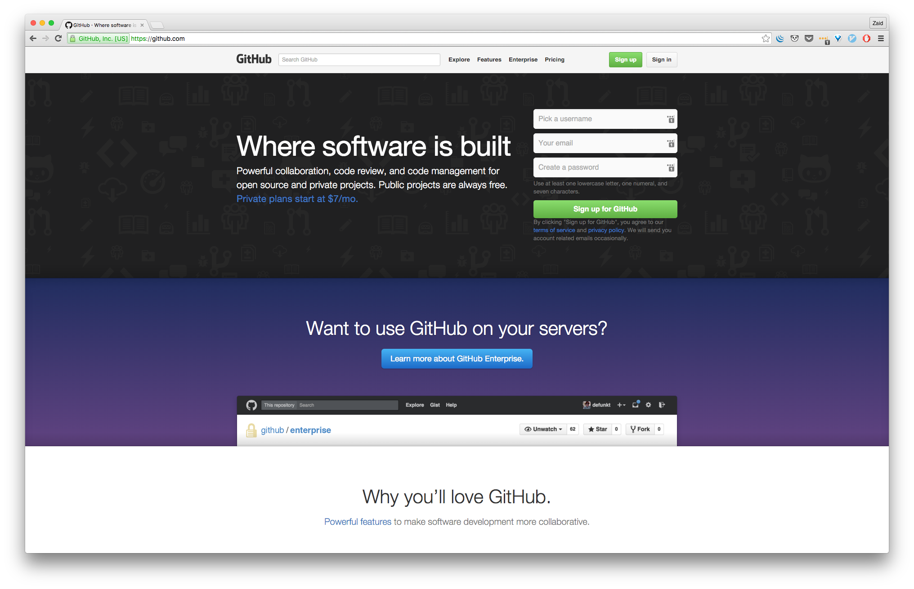
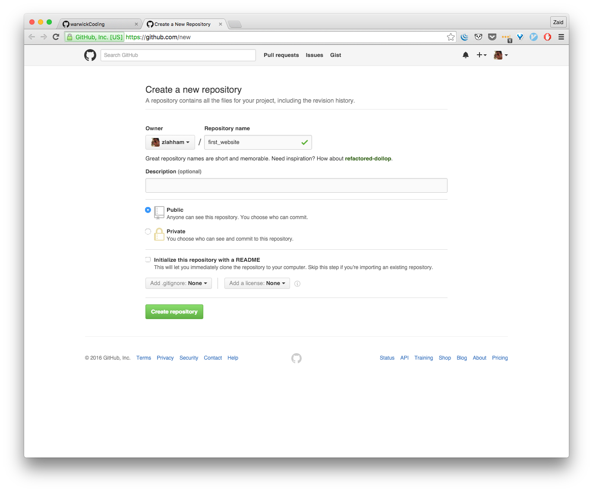
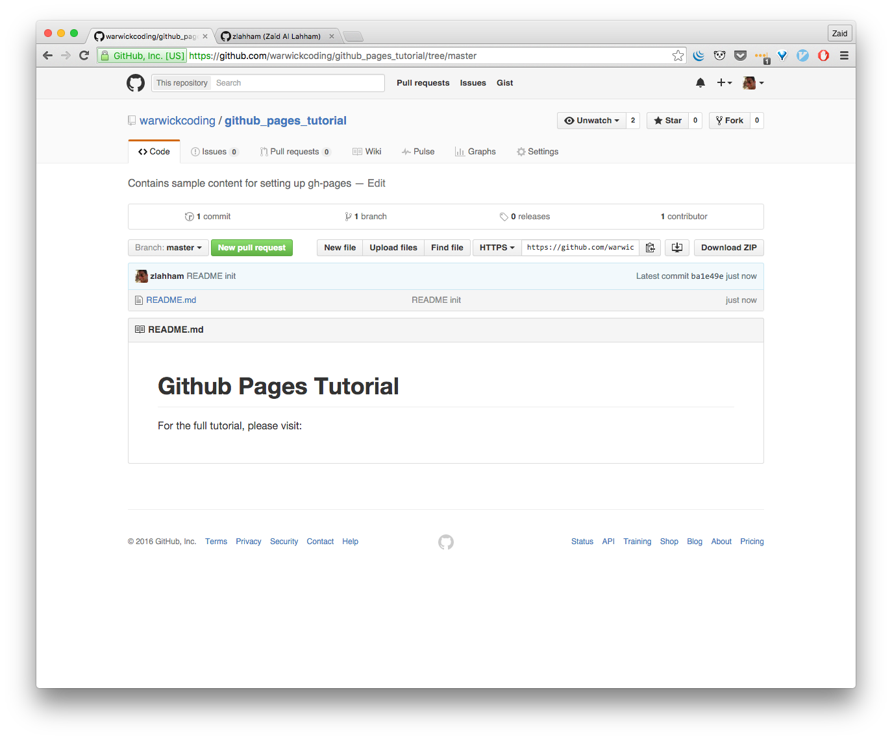
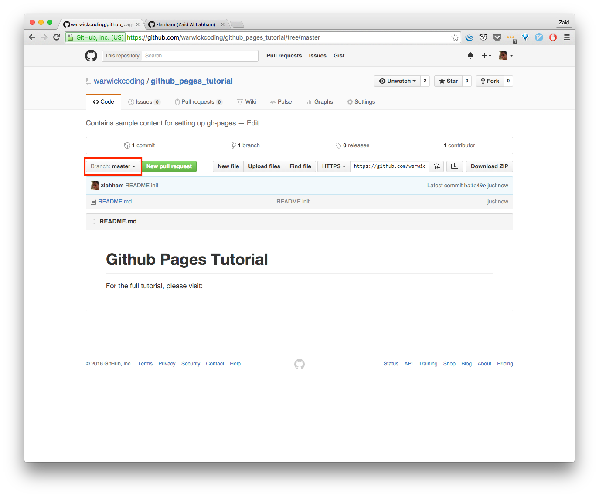
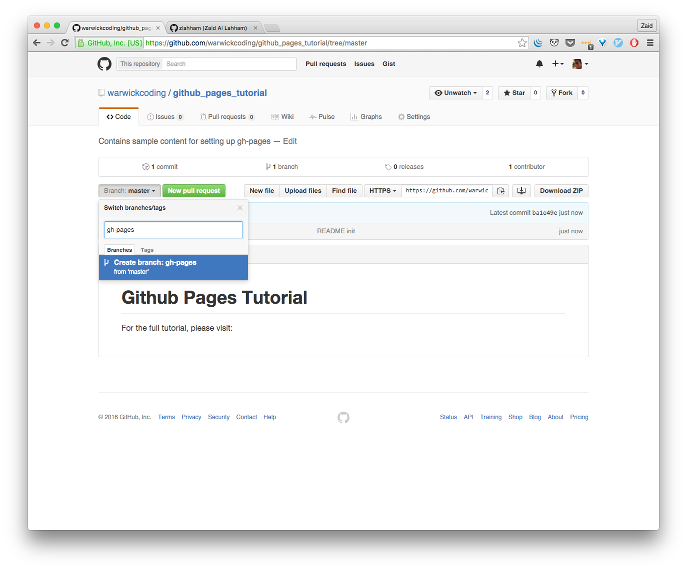

## Frontend Session 8

**Session Navigation:**

| [S1 ](../session_1/README.md) | [S2  ](../session_2/README.md) |[S3  ](../session_3/README.md) |[S4  ](../session_4/README.md) |[S5  ](../session_5/README.md) |[S6  ](../session_6/README.md) |[S7  ](../session_7/README.md) |[S8  ](../session_6/README.md)|
|-------------------------------|--------------------------------|-------------------------------|-------------------------------|-------------------------------|-------------------------------|-------------------------------|------------------------------|

Session outline:
- Completing session 6 & 7 tutorials
- Introduction to the flex-box
- Flex-box game
- Introduction to Github pages
- Tutorial for publishing content  with Github pages
- Questions

Recap for Sessions 6 & 7
------------------------
Session 6 was all about linking our knowledge of HTML with CSS in a project that we built from scratch! We then moved on to learning more about HTML and CSS when we introduced Bootstrap, a framework that makes it easier for us to work with CSS and HTML.

For those of you that haven't had the chance to complete the tutorials, please feel free to do so before moving on to the next section.

Intro to Flexible box
---------------------
This is a new area in CSS that we haven't come across yet. Before CSS3, we had to use the block model with floats (covered in Session 5). The flexible block is arguably an easier to use alternative to floats when it comes to positioning elements in a page. This also makes it easier to position child elements within a `div`.

Understandably, positioning in CSS could be quite annoying and this is why we're learning about this new topic!

Flexbox game
------------
In order for us to get up to speed and learn how to use the flexible box, we're going to play a really fun game. If you have ever played the addictive Frogger game, you're definitely going to enjoy this!
Visit this [website](http://flexboxfroggy.com/) and complete all 24 levels before moving on to the next section. Good luck 🐸🐸🐸

**BONUS**: If you enjoyed the game, then checkout this [tower defense game](http://www.flexboxdefense.com) that will also teach you how to use flex box.

Intro to Github Pages
---------------------
As this is our last session, it's about time to introduce a great feature that is provided by this website, [Github](https://github.com). For those of you that don't know, Github is a [`git`]( https://en.wikipedia.org/wiki/Git_software ) repository hosting service that allows developers to collaborate on projects together. Think of it as a Google Drive for your code, well sort of... We are not going to go into how to use it or how to use the technology that it relies on, `git`, as this is outside the scope of this course. However, I would recommend that you learn how to use `git` and Github, because it is a very important skill to have by any software developer. Checkout this [tutorial](http://try.github.com/) if you are interested in learning more about `git`.

Moving on to the important bit. As previously mentioned, Github provides many features that are beloved by the open source community because they are provided for free. The one feature that we will be exploring today is the [Github Pages](https://pages.github.com/).

Github pages allows you to host your "static" website straight from a repository on Github! In other words, we can have a website live in minutes for free! Quite neat, eh?

Another cool thing about Github pages is that you can create as many websites as you want.

Here are a few of the thousands of websites that are hosted on Github pages:
- [Twitter Bootstrap](http://getbootstrap.com/)
- [Electron](http://electron.atom.io/)
- [Facebook's React](https://facebook.github.io/react/)

It is also worth pointing out that with Github pages, you get access to a great and expansive Content Delivery Network ([CDN](https://en.wikipedia.org/wiki/Content_delivery_network)). Which means your content will be loaded much faster anywhere in the world.

Tutorial on using Github Pages
------------------------------
To host our project on Github, we first need to have some HTML and CSS files that we have previously created, ready for uploading.
You can use any of the projects that you have built in any of the previous sessions.

After you have decided on which files you would like to use, open a new Chrome tab and visit github.com. Please follow these steps carefully 😊

- Sign in to you Github account

- Click on the plus (+) button in the top-right corner and select "New repository"

- Fill in a name for your new repo

- Click on the "Initialize this repository with a README"

- Then, click on "Create repository"

- You will then be taken to a page that looks like this:

- It can be confusing to look at this page for the first time. Don't worry, we are only concerned with a few buttons on this page.

- Please click on the "Branch:**master**" button, like so:

- This will show a text area, in which you can type the name of a new branch. In this case, we want to create a branch called "gh-pages". Then, click on the "Create branch: gh-pages" button.

